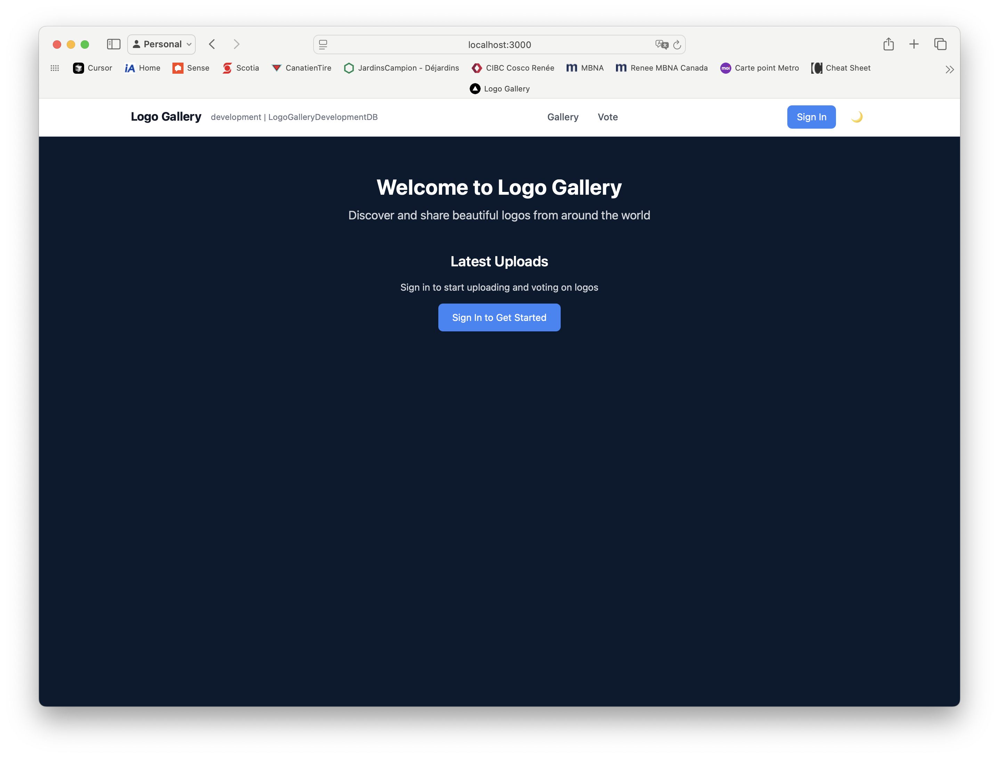

## Homepage Design

### Signed Out State


The homepage in its signed-out state features:

- **Navigation Bar**
  - Logo Gallery branding with development environment indicator
  - Main navigation links (Gallery, Vote)
  - Sign In button (top right)
  - Dark mode toggle

- **Content Layout**
  - Clean, dark navy background (`bg-[#0A1A2F]`)
  - Centered content with maximum width constraint
  - Welcome heading: "Welcome to Logo Gallery"
  - Descriptive subtitle: "Discover and share beautiful logos from around the world"
  - Latest Uploads section with sign-in prompt
  - Primary call-to-action: "Sign In to Get Started" button

- **Typography**
  - Inter font family throughout
  - Large, bold welcome heading
  - Lighter weight for descriptive text
  - Consistent text colors (white for headings, gray for secondary text)

- **Interactive Elements**
  - Sign In button in navigation (opens modal overlay)
  - Sign In to Get Started button (centered, primary action)
  - Smooth hover transitions on buttons and links

- **Background**: Dark navy (`bg-[#0A1A2F]`)
- **Layout**: Centered content with max width of 4xl and vertical padding of 24 units
- **Components**:
  1. Welcome Message
     - Large title (text-5xl) with tight tracking
     - Subtitle in gray-300 with relaxed line height
  2. Latest Uploads Section
     - Section title in white
     - Sign-in prompt
     - Call-to-action button with hover effects and shadow
  3. Loading State
     - Animated pulse effect
     - Placeholder elements for content

### Signed In State
- **Layout**: Same base layout as signed-out state
- **Components**:
  1. Personalized Welcome
     - "Welcome back, [User Name]!"
     - Larger text size with gray-300 color
  2. Action Buttons
     - "Upload New Logo" (Primary blue button)
     - "Browse Gallery" (Secondary gray button)
     - Consistent padding and hover effects

### Authentication Modal
- **Overlay**: Semi-transparent dark background with blur effect
- **Modal Content**:
  - Clean white text on dark background
  - Form fields for email/password
  - Error handling with visual feedback
  - Loading states during authentication
  - Smooth transitions for opening/closing

### Responsive Behavior
- Centered content on all screen sizes
- Fluid typography scaling
- Responsive padding and spacing
- Mobile-friendly button sizes

### Color Scheme
- Primary Background: `#0A1A2F`
- Text Colors:
  - Headers: White
  - Body: gray-300
  - Secondary: gray-500
- Buttons:
  - Primary: blue-500 (hover: blue-600)
  - Secondary: gray-700 (hover: gray-600)

### Typography
- Font Family: Inter
- Title: 5xl (3rem)
- Subtitle: xl
- Button Text: lg
- Regular Text: Base size

### Animations
- Button hover transitions
- Modal fade in/out
- Loading state pulse animations
- Smooth state transitions 

## Page Hierarchy

```
app/
├── layout.tsx                 # Root layout with providers and navigation
├── page.tsx                  # Homepage (/)
│   ├── Signed Out View
│   └── Signed In View
│
├── gallery/                  # Gallery section
│   ├── page.tsx             # Main gallery view (/gallery)
│   └── [id]/                # Individual logo pages
│       └── page.tsx         # Logo detail view (/gallery/[id])
│
├── upload/                   # Upload section
│   └── page.tsx             # Logo upload form (/upload)
│
├── auth/                     # Authentication pages
│   └── signin/              
│       └── page.tsx         # Sign-in page (/auth/signin)
│
├── api/                      # API routes
│   ├── auth/                # Authentication endpoints
│   │   └── [...nextauth]    # NextAuth.js configuration
│   └── logos/               # Logo management endpoints
│       ├── route.ts         # GET, POST /api/logos
│       └── [id]/            
│           └── route.ts     # GET, PUT, DELETE /api/logos/[id]
│
└── components/              # Shared components
    ├── AuthModal.tsx        # Authentication modal
    ├── LogoCard.tsx         # Logo display card
    ├── Navbar.tsx           # Navigation bar
    └── ui/                  # UI components
        ├── Button.tsx
        └── Input.tsx

```

### Page Descriptions

1. **Homepage** (`/`)
   - Entry point of the application
   - Conditional rendering based on auth state
   - Latest uploads preview
   - Quick actions for signed-in users

2. **Gallery** (`/gallery`)
   - Grid layout of logo cards
   - Infinite scroll pagination
   - Search and filter options
   - Sorting functionality

3. **Logo Detail** (`/gallery/[id]`)
   - Full logo display
   - Metadata and description
   - Owner information (referenced by userId)
   - Rating and comments
   - Edit/delete options for logo owner
   - Ownership determined by matching userId with current user

4. **Upload** (`/upload`)
   - Logo upload form
   - Image preview
   - Metadata input
   - Tag management

5. **Authentication** (`/auth/signin`)
   - Sign in form
   - OAuth providers
   - Registration option
   - Password reset

### Component Relationships

- **Layout**: Wraps all pages with common elements
  - Navbar: Present on all pages
  - AuthModal: Available globally
  - Theme provider: Consistent styling

- **Gallery**: Uses LogoCard components
  - Each card links to detail page
  - Implements infinite scroll
  - Handles loading states

- **Upload**: Standalone form
  - Image preview component
  - Tag input component
  - Progress indicator 

## Screenshots

### Required Screenshots
To complete the design documentation, the following screenshots need to be captured:

1. **Homepage**
   - Signed out state (`./docs/images/homepage-signedout.png`)
   - Signed in state (`./docs/images/homepage-signedin.png`)
   - Authentication modal (`./docs/images/auth-modal.png`)

2. **Gallery**
   - Main gallery view (`./docs/images/gallery-main.png`)
   - Logo detail view (`./docs/images/logo-detail.png`)
   - Search and filter interface (`./docs/images/gallery-search.png`)

3. **Upload**
   - Upload form (`./docs/images/upload-form.png`)
   - Image preview (`./docs/images/upload-preview.png`)
   - Success state (`./docs/images/upload-success.png`)

### How to Capture Screenshots
1. Use the macOS screenshot tool (Cmd + Shift + 4)
2. Save screenshots in the `docs/images` directory
3. Use descriptive names as shown above
4. Ensure the application is in dark mode for consistency
5. Capture full-page screenshots where applicable

### Design Assets
The following design assets should also be created:

1. **Color Palette**
   - Create a visual representation of the color scheme
   - Save as `./docs/images/color-palette.png`

2. **Typography**
   - Show all text styles with examples
   - Save as `./docs/images/typography.png`

3. **Layout Grid**
   - Desktop layout (`./docs/images/layout-desktop.png`)
   - Tablet layout (`./docs/images/layout-tablet.png`)
   - Mobile layout (`./docs/images/layout-mobile.png`) 