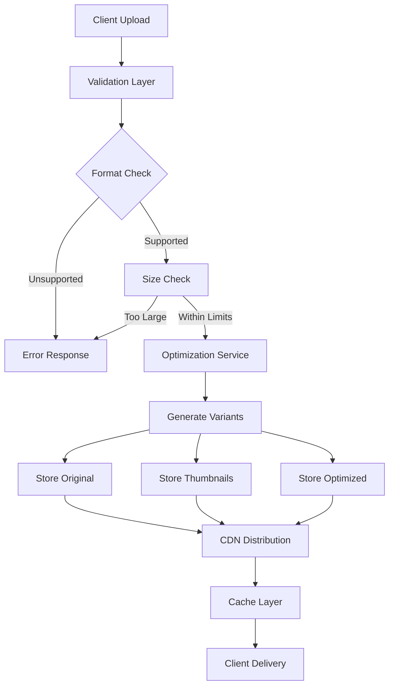
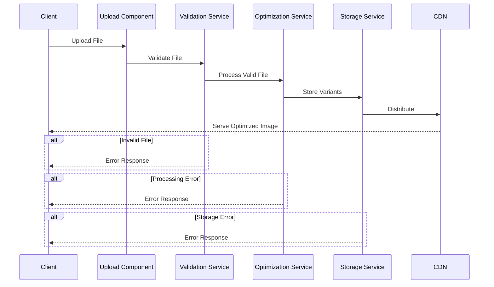
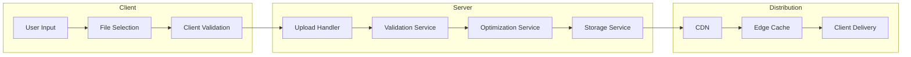
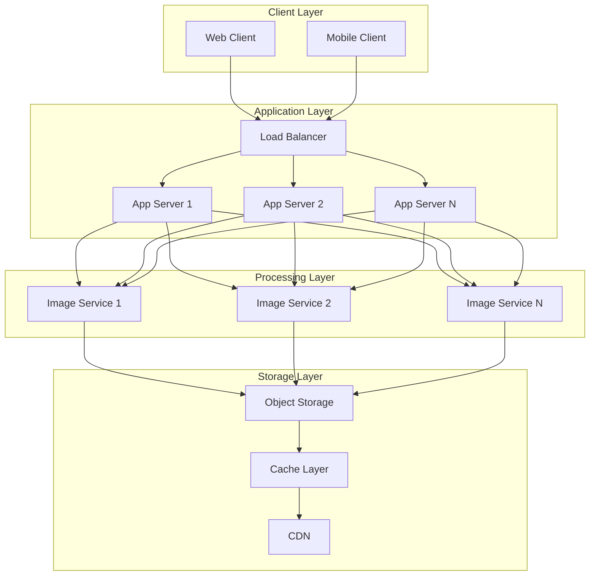
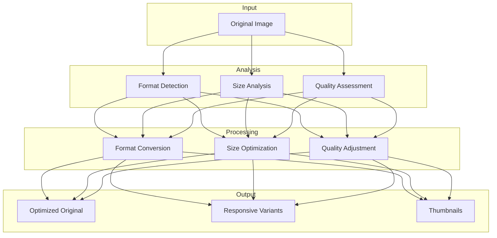

# Image Handling System Architecture

## Table of Contents
1. [Image Processing Flow](#image-processing-flow)
2. [Component Interaction](#component-interaction)
3. [Data Flow](#data-flow)
4. [Deployment Architecture](#deployment-architecture)
5. [Performance Optimization Pipeline](#performance-optimization-pipeline)

## Image Processing Flow

### Process Description
1. **Client Upload**
   - Handles file selection and initial client-side validation
   - Provides immediate feedback on file type and size
   - Implements retry mechanism for failed uploads

2. **Validation Layer**
   - Validates file integrity
   - Checks MIME types
   - Verifies file dimensions
   - Ensures security requirements

3. **Optimization Service**
   - Applies compression algorithms
   - Converts formats for optimal delivery
   - Generates responsive variants
   - Preserves metadata when required

4. **Storage & Distribution**
   - Implements multi-tier storage strategy
   - Handles CDN integration
   - Manages cache invalidation
   - Ensures high availability

## Component Interaction

### Component Details
1. **Upload Component**
   - Handles file selection UI
   - Implements drag-and-drop
   - Shows upload progress
   - Manages error states

2. **Validation Service**
   - File type validation
   - Size restrictions
   - Security checks
   - Format verification

3. **Optimization Service**
   - Format conversion
   - Size optimization
   - Variant generation
   - Quality management

4. **Storage Service**
   - File system operations
   - CDN integration
   - Cache management
   - Cleanup routines

## Data Flow

### Flow Description
1. **Client-Side Flow**
   - User selects file
   - Client validates format/size
   - Initiates upload
   - Handles progress/errors

2. **Server-Side Flow**
   - Receives upload
   - Validates content
   - Processes image
   - Stores variants

3. **Distribution Flow**
   - CDN integration
   - Cache management
   - Edge distribution
   - Client delivery

## Deployment Architecture

### Architecture Components
1. **Client Layer**
   - Web interface
   - Mobile apps
   - API clients
   - Third-party integrations

2. **Application Layer**
   - Load balancing
   - Request routing
   - Authentication
   - Rate limiting

3. **Processing Layer**
   - Image optimization
   - Format conversion
   - Variant generation
   - Error handling

4. **Storage Layer**
   - Object storage
   - Caching system
   - CDN integration
   - Backup management

## Performance Optimization Pipeline

### Pipeline Stages
1. **Input Processing**
   - File validation
   - Metadata extraction
   - Format identification
   - Initial analysis

2. **Optimization Analysis**
   - Quality assessment
   - Size evaluation
   - Format selection
   - Variant planning

3. **Processing Pipeline**
   - Format conversion
   - Size reduction
   - Quality optimization
   - Variant generation

4. **Output Management**
   - Result validation
   - Storage distribution
   - Cache population
   - Client delivery 