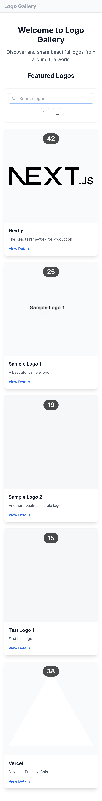
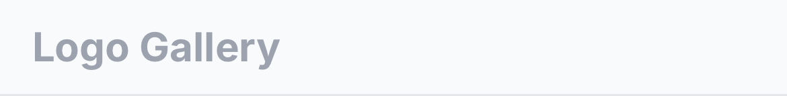
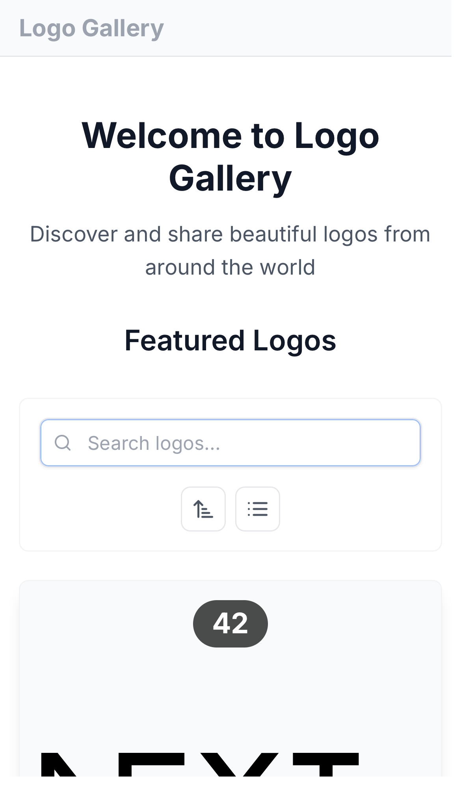
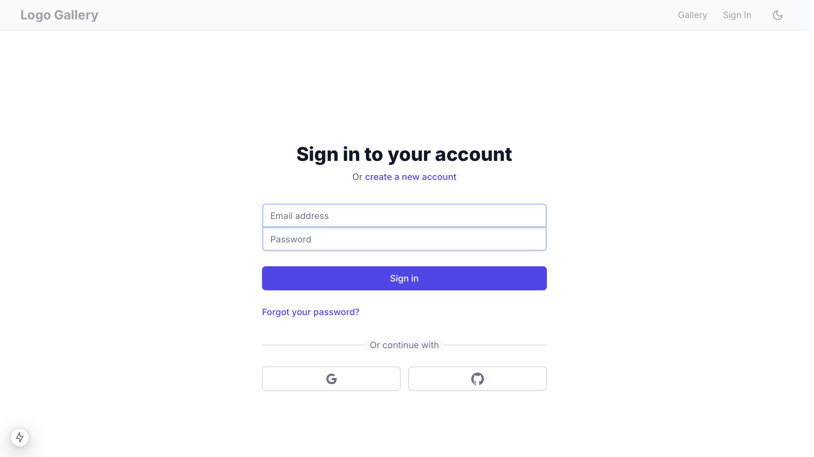
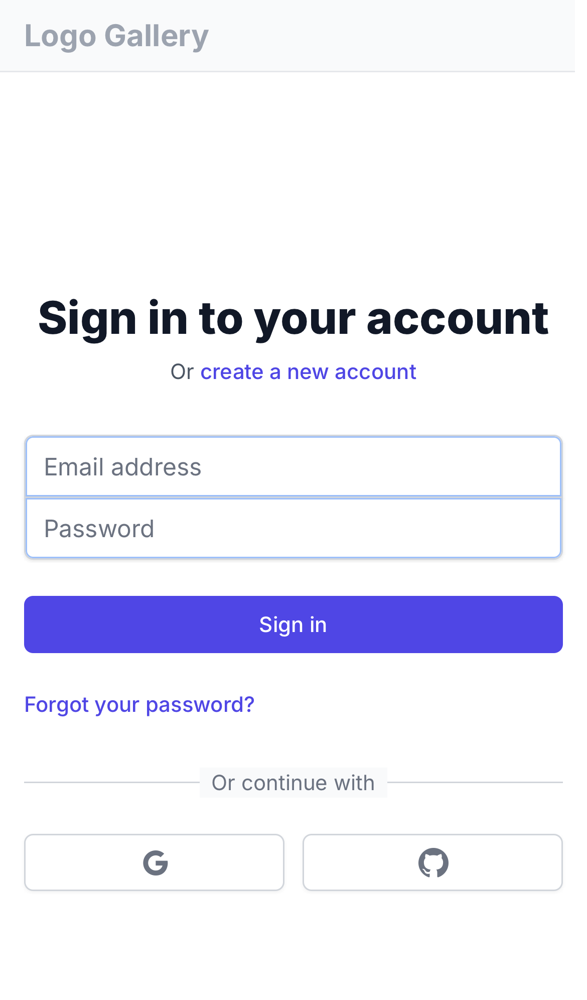
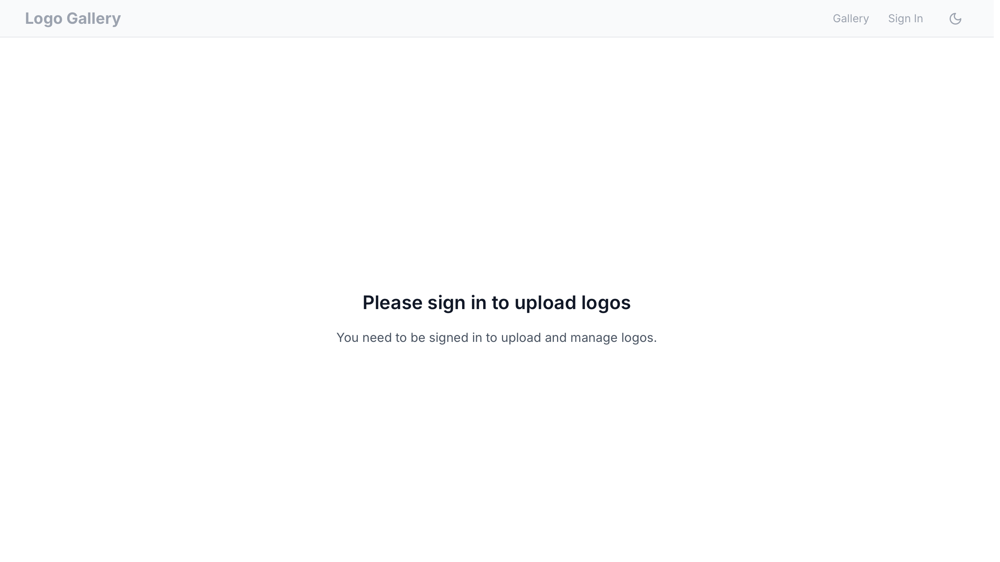
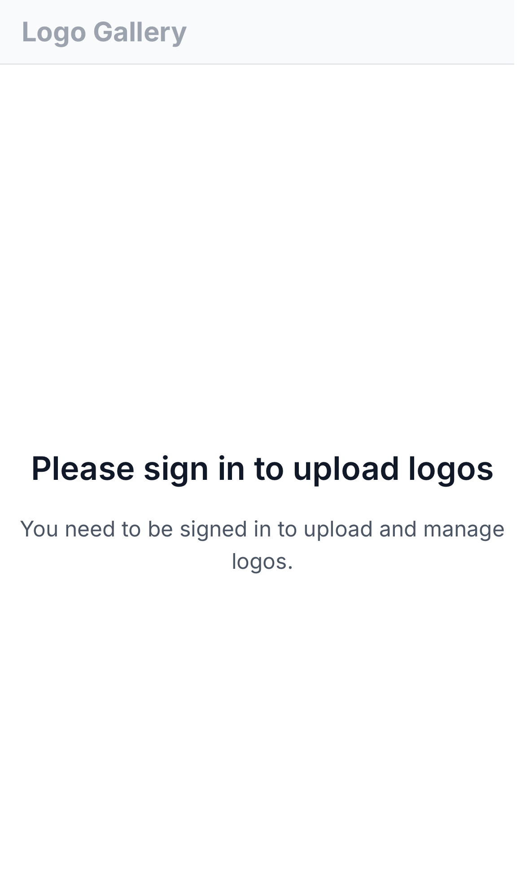
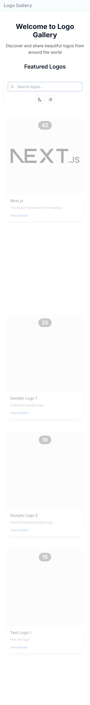
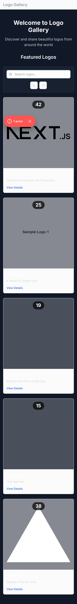

# Logo Gallery Design Documentation

This document provides a comprehensive overview of the Logo Gallery application's design system and UI components.

## Layout & Navigation

### Homepage Layout

The homepage features a clean, modern layout with:
- Hero section with gradient background and clear call-to-action buttons
- Featured logos section with error handling and retry mechanism
- Responsive grid of logo cards with optimized loading
- Suspense boundaries for improved user experience

### Navigation Components

The navigation system includes:
- Sticky header with improved mobile responsiveness
- Smooth mobile menu transitions with proper ARIA attributes
- User authentication status with loading states
- Theme toggle with proper accessibility labels
- Error boundaries for resilient navigation

## Core Components

### Logo Cards

Logo cards are designed to:
- Display optimized SVG and image logos
- Show essential metadata with proper loading states
- Provide clear interaction states with error handling
- Scale smoothly across different screen sizes
- Support dark mode with proper contrast

### Upload Interface

The upload interface features:
- Drag-and-drop file upload with SVG support
- Multi-file support with type validation
- Progress indicators and loading states
- Clear error feedback and retry options

## User Interface States

### Authentication

The authentication system features:
- Clean, accessible form layout
- Social authentication with loading states
- Comprehensive error handling with visual feedback
- Client-side validation and server error display
- Proper mounting behavior to prevent flicker
- Dark mode support with smooth transitions
- Mobile-optimized layout
- Clear loading indicators for all actions
- Error boundaries with retry options

### Theme Variants

The application supports both light and dark themes with:
- Consistent color palette with proper contrast
- Smooth theme transitions for all components
- Proper text and background color combinations
- Persistent theme preference
- Loading states that respect current theme

### Loading States

The application implements comprehensive loading states:
- Customizable loading spinner with size variants
- Skeleton loading for content
- Loading indicators for user actions
- Proper loading state management for:
  - Authentication
  - Image loading
  - Content fetching
  - Form submissions
  - Theme changes

### Error Handling

Enhanced error handling includes:
- Clear error messages with icons
- Error boundaries with fallback UI
- Retry mechanisms for failed operations
- Proper error state styling in both themes
- Accessible error notifications
- Graceful degradation

## Design System

### Colors
- Primary: #3B82F6 (Blue)
- Error: #EF4444 (Red)
- Success: #10B981 (Green)
- Background Light: #F9FAFB
- Background Dark: #111827
- Text Light: #111827
- Text Dark: #F9FAFB

### Typography
- Headings: Inter (Bold)
- Body: Inter (Regular)
- Monospace: JetBrains Mono (Code elements)

### Spacing
- Base unit: 4px
- Common spacing values: 4px, 8px, 12px, 16px, 24px, 32px, 48px
- Layout gutters: 16px (mobile), 24px (tablet), 32px (desktop)

### Animations
- Theme transition: 200ms ease-in-out
- Loading spinner: 600ms linear infinite
- Error fade: 150ms ease-in
- Menu transition: 150ms ease-out

### Breakpoints
- Mobile: < 640px
- Tablet: 640px - 1024px
- Desktop: > 1024px

### Accessibility
- ARIA labels for interactive elements
- Proper heading hierarchy
- Keyboard navigation support
- Screen reader considerations
- Sufficient color contrast
- Focus management 